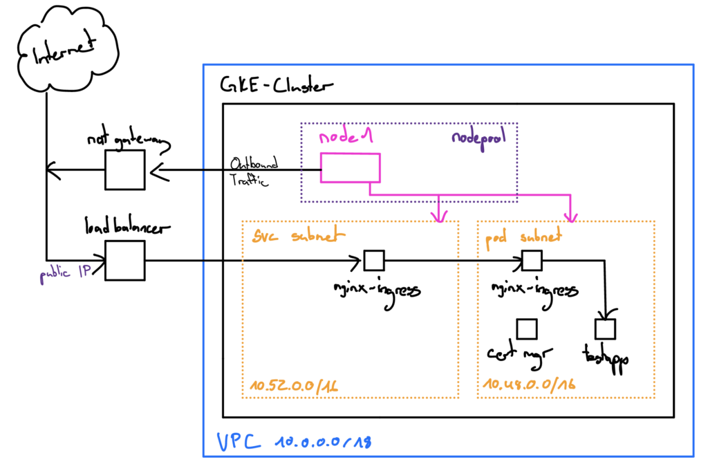

# terraform-gke
My Terraform Charts to deploy GKE Clusters

## One-Node-Cluster with Workloads
A simple cluster with one node and workloads.

**GKE Cluster**

- Nodepool<br />
  1 Node (n1-standard-1)
- Network<br />
  VPC (10.0.0.0/18)<br />
  Subnet k8s-pod-range (10.48.0.0/16)<br />
  Subnet k8s-service-range (10.52.0.0/16)<br />
  NAT Gateway (outbound traffic)<br />

**Workloads**

- NGINX Ingress Controller (HELM Chart)<br />
  Creates also a Load Balancer with a Public IP in GCP
- Cert Manager (HELM Chart)<br />
  Automatic issuance of SSL-Certificates for Nginx-Ingress Resources<br />
  i.e. for the web service in module "testapp"
- Test-App (nginx webserver)<br />
  simple web app for testing



# Usage

```
# initialize terraform modules
terraform init

# login google cloud gcp
gcloud auth login

# edit variables.tf
- whitelist-ips => set to your private IP
- project => set to your gcp project name

# apply terraform chart
terraform apply
```